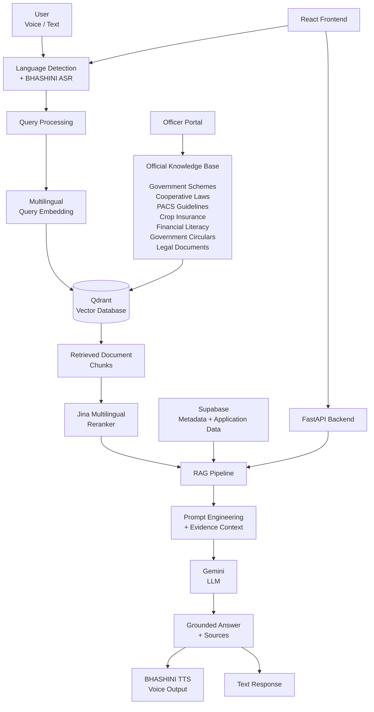
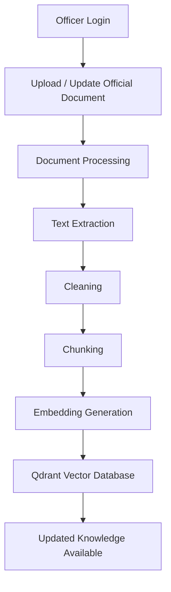
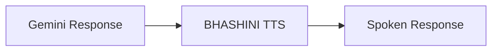

# Sanyukt Vaani

### Multilingual Cooperative Governance & Legal Assistance Platform

Sanyukt Vaani is a multilingual, voice-enabled AI platform designed to help citizens access **government schemes, cooperative information, legal guidance, crop insurance, financial literacy, PACS information, and official documents**.

---

## 🚀 What Sanyukt Vaani Does

- 🌐 Multilingual interaction
- 🎙️ Voice-based queries
- 📝 Text-based queries
- 🔎 Official-document retrieval
- 🧠 Retrieval-Augmented Generation (RAG)
- 📚 Evidence-grounded responses
- 🔊 Voice responses using BHASHINI
- 🏛️ Officer Portal for knowledge updates

---

## 🏗️ System Architecture



---

## 🔄 RAG Pipeline

```text
User Query
    │
    ▼
Language Detection / Speech-to-Text
    │
    ▼
Query Embedding
    │
    ▼
Qdrant Vector Search
    │
    ▼
Top-K Candidate Retrieval
    │
    ▼
Jina Multilingual Reranking
    │
    ▼
Relevant Evidence Selection
    │
    ▼
Prompt + Retrieved Context
    │
    ▼
Gemini
    │
    ▼
Evidence-Grounded Answer
    │
    ▼
Text / BHASHINI TTS
```

---

## 🧠 AI & RAG Components

| Component | Technology | Purpose |
|---|---|---|
| Speech-to-Text | BHASHINI ASR | Converts speech into text |
| Embeddings | `paraphrase-multilingual-MiniLM-L12-v2` | Creates multilingual vectors |
| Vector Database | Qdrant | Semantic vector search |
| Reranking | `jinaai/jina-reranker-v2-base-multilingual` | Reranks retrieved documents |
| RAG | Custom Pipeline | Retrieves and supplies evidence |
| LLM | Gemini | Generates responses |
| Text-to-Speech | BHASHINI TTS | Generates voice output |
| Database | Supabase | Application and metadata storage |

---

## 📊 Knowledge Base

| Metric | Value |
|---|---:|
| Documents / Sources | 83 |
| Chunks / Vectors | 18,890 |
| Embedding Dimension | 384 |
| Vector Database | Qdrant |
| Similarity Metric | Cosine |
| Reranker | Jina Multilingual Reranker |

---

## 🏛️ Officer Portal

The Officer Portal allows authorized officers to update the knowledge base.

### Knowledge Update Flow



---

## 🎙️ Voice Interaction

### Voice Input


### Voice Output



---

## 🛠️ Technology Stack

### Frontend

- React
- JavaScript
- Multilingual UI
- Voice interaction

### Backend

- Python
- FastAPI
- REST APIs

### AI / NLP

- Sentence Transformers
- Multilingual Embeddings
- Jina Multilingual Reranker
- Gemini
- Retrieval-Augmented Generation

### Voice

- BHASHINI ASR
- BHASHINI TTS

### Databases

- Qdrant
- Supabase

### Development

- Git
- GitHub
- Python Virtual Environment
- Environment Variables

---

## 📁 Project Structure

```text
Sanyukt-Vaani/
│
├── frontend/
│   ├── components/
│   ├── pages/
│   ├── services/
│   └── ...
│
├── backend/
│   ├── main.py
│   ├── routes/
│   ├── models/
│   └── ...
│
├── rag/
│   ├── documents/
│   │   ├── cooperative_laws/
│   │   ├── crop_insurance/
│   │   ├── financial_literacy/
│   │   ├── government_schemes/
│   │   ├── grievance_redressal/
│   │   ├── maharashtra_cooperation/
│   │   ├── official_government_documents/
│   │   └── pacs/
│   │
│   ├── knowledge_base/
│   │   ├── extracted_text/
│   │   ├── cleaned_text/
│   │   ├── chunks/
│   │   └── embeddings/
│   │
│   └── scripts/
│       ├── extract_documents.py
│       ├── clean_text.py
│       ├── chunk_text.py
│       ├── create_embeddings.py
│       ├── retriever.py
│       └── test_ocr.py
│
├── hardware/
│   ├── esp32/
│   └── raspberry_pi/
│
├── tests/
├── docker/
│
├── .env.example
├── .gitignore
├── requirements.txt
└── README.md
```

---

## ⚙️ Local Setup

### Clone

```bash
git clone https://github.com/Taufik7860/Sanyukt-Vaani.git
cd Sanyukt-Vaani
```

### Backend

```bash
python -m venv .venv
```

Windows:

```powershell
.venv\Scripts\Activate.ps1
```

Install dependencies:

```bash
pip install -r requirements.txt
```

Start FastAPI:

```bash
uvicorn backend.main:app --reload
```

### Frontend

```bash
cd frontend
npm install
npm run dev
```

---

## 🔐 Environment Variables

Copy `.env.example` to `.env` and configure the required credentials.

```text
GEMINI_API_KEY
QDRANT_URL
QDRANT_API_KEY
SUPABASE_URL
SUPABASE_KEY
BHASHINI credentials
OFFICER_EMAIL
OFFICER_PASSWORD
OFFICER_SESSION_SECRET
```

> Never commit `.env` or production credentials to GitHub.

---

## 📌 Project Goals

Sanyukt Vaani aims to make government, cooperative, agricultural, financial, and legal information easier to access through:

- Multilingual interaction
- Voice interfaces
- Official-document retrieval
- Evidence-grounded AI
- Structured knowledge updates
- Accessible citizen-facing interfaces